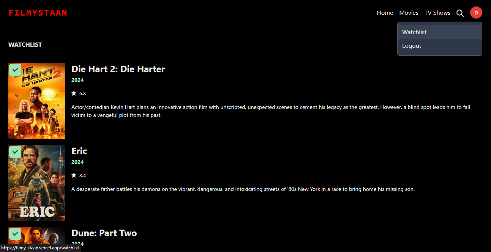

# FilmyStaan

FilmyStaan is your ultimate destination to explore and engage with movies. Powered by Chakra, ReactJS, Firebase, and TMDB API, it offers a seamless cinematic experience with a plethora of features.

**Live Deployed Link:** [FilmyStaan Live](https://film-staan.vercel.app/)

## Features

### Dynamic Routing

Easily navigate through our extensive collection of movies with intuitive dynamic routing, ensuring a smooth and immersive browsing experience.


### Authentication & Authorization

Securely access your personalized FilmyStaan account with robust authentication and authorization mechanisms, safeguarding your data and preferences.


### Watchlist

Curate your own watchlist of movies to watch later, conveniently organizing your cinematic preferences for easy access and reference.



### TMDB Integration

Leverage the power of TMDB API to access comprehensive movie data, including details, ratings, reviews, and more, enriching your movie exploration journey.


### Dynamic Searching

Enhance your movie discovery experience with dynamic searching, powered by TMDB API, allowing you to easily find and explore a wide range of movies.

## Getting Started

1. Clone the repository:

   ```bash
   git clone https://github.com/DeepRahangdale/FilmyStaan
   ```

2. Install dependencies:

   ```bash
   npm install
   ```

3. Start the development server:

   ```bash
   npm run dev
   ```

4. **Adding Environment Variables:**

   Ensure to add the following environment variables to your project. You can create a `.env` file in the root directory and add these variables:

   ```plaintext
   VITE_API_KEY=
   VITE_FIREBASE_API_KEY=
   VITE_FIREBASE_AUTH_DOMAIN=
   VITE_FIREBASE_PROJECT_ID=
   VITE_FIREBASE_STORAGE_BUCKET=
   VITE_FIREBASE_MESSAGING_SENDER_ID=
   VITE_FIREBASE_APP_ID=
   ```

   These variables are crucial for the smooth running of the project.

**Live Deployed Link:** [FilmyStaan Live](https://film-sphere.vercel.app/)

## Contribute

FilmyStaan is open-source, and we welcome contributions from the community. Feel free to submit bug reports, feature requests, or pull requests to help us improve FilmyStaan together.
Let me know if there's anything else you'd like to add or modify!
